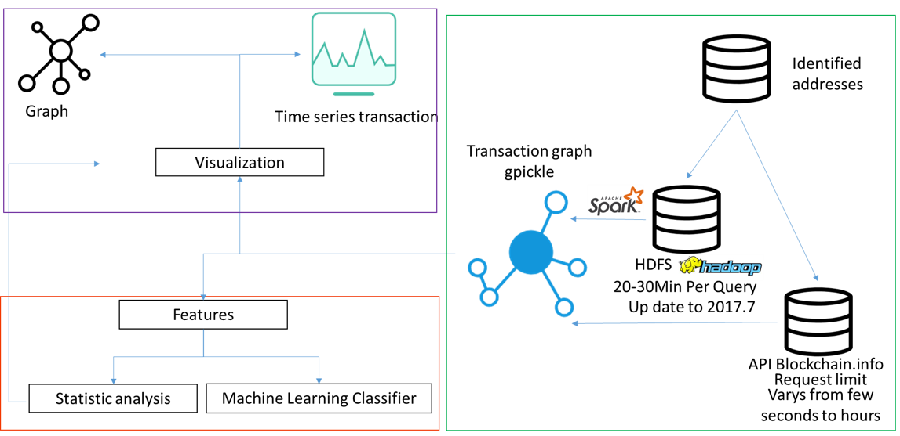

# Bitcoin Criminality


## View the Visualization:
https://ljm0.github.io/BitcoinCriminality-DataProcessing-Visualization/


## How to use

### source
- download_list.py || collect data from web site
- network_entrance.py || transfer transaction records to networkx graph structures
- address_format.log || criminality related addresses
- valid negative || addresses of donors || (hash160,address)

### source/analysis
- analysis.ipynb || all analysis work contained
- func_lsde.py || store the analysis function of network
- main_final.py || feature analysis and extraction
- time_difference.py || calcualte the transaction time difference of 
- central_pointupdate.py || calculate number one2multi structure

### source/visualization
- NetworkGraph.py || Generate the json data format from gpickle for Network Graph
- TimeBar.py || Generate the json data format from gpickle for Tiem TimeBar
- SubGraph.py || Generate the sub graph from gpickle for Network Graph
- echarts.min.js || Echars library 

### Visualization
- index.html: show some examples of graph and time bar
- four floders contains all graphs and time bars(graph_Crime, graph_Normal, Time_crime, Time_Normal)

### Scala Code 
Also stored at remote machine, lsde11/~/lsde11/hadoopcryptoledger-master/example/scala-spark-graphx-bitcointransaction/
--\src\main\scala\org\zuinnote\spark\bitcoin\example\SparkScalaBitcoinTransactionGraph.scala 
- source code directly modify it on example code
	- SparkScalaBitcoinTransactionGraph
    - transfer raw data to source-distination form
	- example
```
spark-submit --master yarn
	     --deploy-mode client
             --num-executors 80     
             --executor-memory 3G    
             --class org.zuinnote.spark.bitcoin.example.SparkScalaBitcoinTransactionGraph 
             example-hcl-spark-scala-graphx-bitcointransaction.jar 
             /user/hannesm/lsde/bitcoin 
             /user/lsde11/tmp/parquentdata 
             data 
             3563885D01CB9111F2B985823D1827CF71CBBC08 
```

- extractTransactionData
- collect transaction records for specific address
- example
```
spark-submit --master yarn
             --deploy-mode client
             --num-executors 50 
             --executor-memory 4G
             --class org.zuinnote.spark.bitcoin.example.extractTransactionGraph
             target/scala-2.10/example-hcl-spark-scala-graphx-bitcointransaction.jar
             /user/lsde11/tmp/parquentdata/data/dataWithHash 
             /user/lsde11/reformed/Ransomware 
             CryptoTorLocker2015
             CE682FCE869F6E9203A0189DD8CDC9ACD847259D
```
